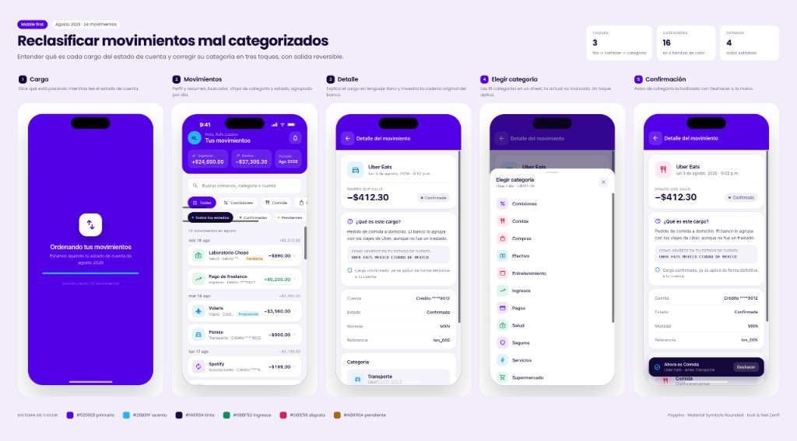

# Zenfi — Frontend Challenge

**[Rafael Lozano Rolón](https://rafalozano.dev)** · Senior Frontend Engineer

| | |
| --- | --- |
| **Portfolio** | [rafalozano.dev](https://rafalozano.dev) |
| **CV** | [Rafa-Lozano-sr-frontend-engineer.pdf](./CV/Rafa-Lozano-sr-frontend-engineer%20.pdf) |
| **Demo en vivo** | _pendiente de despliegue — ver [Despliegue](#despliegue)_ |

SPA de movimientos bancarios construido con **Vite + React 19 + TypeScript strict**. Importa
`src/data/movimientos.json` directamente; no hay backend. Mobile-first, accesible y sin librería de
estado global.

---

## Vista general del flujo



*Reclasificar movimientos mal categorizados — entender cada cargo, corregir la categoría en tres
toques y deshacer si te equivocaste.*

| Pantalla | Qué hace |
| --- | --- |
| **Carga** | Normaliza el JSON y muestra el conteo real de movimientos |
| **Movimientos** | Resumen mensual, filtros y lista agrupada por día |
| **Detalle** | Explicación en lenguaje claro + metadatos del cargo |
| **Elegir categoría** | Sheet con las 15 categorías en 4 familias de color |
| **Confirmación** | Toast con **Deshacer** y recálculo instantáneo del resumen |

Decisiones de producto, datos y arquitectura: [`DECISIONES.md`](./DECISIONES.md).

---

## Cómo correrlo

Requisitos: Node `>=22.12` (`.nvmrc`) y pnpm 10 (`corepack enable`).

```bash
corepack enable
pnpm install
pnpm dev
```

Abre http://localhost:5173.

## Scripts

| Script           | Qué hace                 |
| ---------------- | ------------------------ |
| `pnpm dev`       | Servidor de desarrollo   |
| `pnpm build`     | Typecheck + build prod   |
| `pnpm preview`   | Sirve el build local     |
| `pnpm lint`      | ESLint                   |
| `pnpm typecheck` | TypeScript sin emitir    |

## Stack y decisiones

| Área      | Decisión                                       | Por qué                                              |
| --------- | ---------------------------------------------- | ---------------------------------------------------- |
| Build     | Vite                                           | Rápido, cero config extra, ideal para un SPA         |
| UI        | React 19 (componentes funcionales)             | Requisito del reto                                   |
| Tipos     | TypeScript `strict` + `noUncheckedIndexedAccess` | El JSON viene sucio; fallar temprano es más seguro |
| Estilos   | CSS Modules + BEM                              | Scope local, convención clara, sin runtime CSS-in-JS |
| Estado    | `useState` / `useMemo` en hooks                | Una pantalla, sin librería de estado global          |
| Datos     | Import estático del JSON + parseo en utils     | Sin backend; la normalización vive fuera de React    |

## Estructura de carpetas

```text
src/
├── components/          # UI reutilizable (Icon, PhoneShell, SplashScreen)
├── features/movements/  # Dominio: tipos, utils, hooks, componentes de pantalla
├── utils/               # Helpers globales (formato moneda)
├── data/movimientos.json
└── App.tsx
```

Un componente por archivo, un CSS Module por componente, imports directos (sin barrel files).

## Despliegue

Build de producción:

```bash
pnpm build
```

Compatible con **Vercel**, **Netlify** o **GitHub Pages**. Para GitHub Pages, configura `base` en
`vite.config.ts` con el nombre del repo.

El sitio desplegado carga **Poppins** y **Material Symbols** desde Google Fonts; sin red los iconos
se ven como texto plano.

## Entrega

1. Código en este repo (público o con acceso a `SaulMoreyra` y `JohanAlvarado`).
2. [`DECISIONES.md`](./DECISIONES.md) actualizado (máx. una página).
3. Email a saul.aragon@yotepresto.com y johan@yotepresto.com con link al repo **y** URL del demo.

Enunciado completo: [`RETO.md`](./RETO.md).

---

**[Rafael Lozano Rolón](https://rafalozano.dev)** — más proyectos y contacto en
[rafalozano.dev](https://rafalozano.dev) · [CV (PDF)](./CV/Rafa-Lozano-sr-frontend-engineer%20.pdf)
